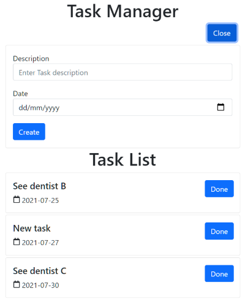
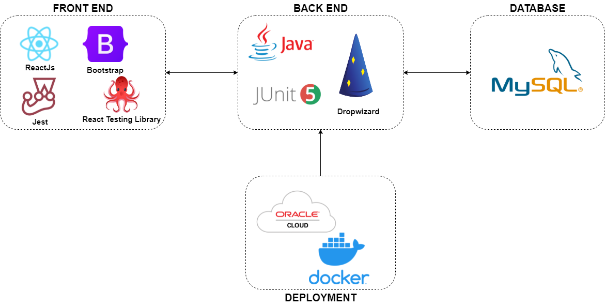
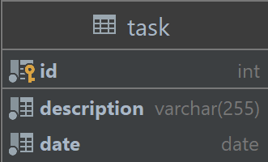

# Overview

## Introduction

This project is a fullstack web application for a personal task manager. User can create, view and manage tasks on a web browser. REST endpoints are provided by services hosted on Oracle Cloud Infrastructure compute instance.

The application can be accessed by this [link](http://140.238.194.85/ "Task manager page").

## Technology stack

Front-end portion of the application is written in ReactJs with Bootstrap 5 and tested with React Testing Library and Jest. Back-end service uses Dropwizard framework and is tested with JUnit 5. For data persistence, MySQL server is used.

## Entity diagram

The entity diagram is simple with only 1 Entity - Task.

